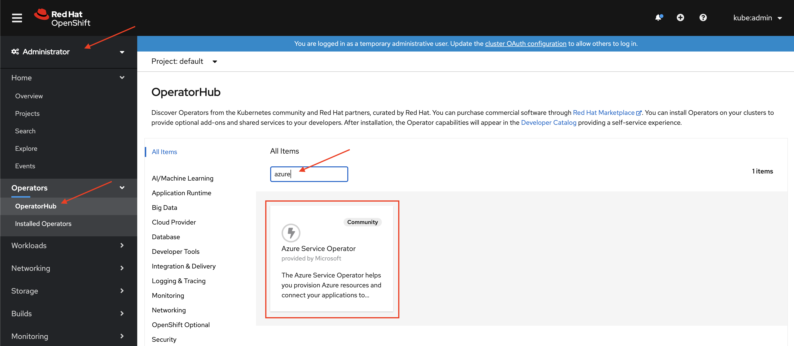

# Installing the Azure Service Operator

Installing the Azure Service Operator in an OpenShift cluster is quite easy, since Openshift 4 has an embedded version of [OperatorHub](https://operatorhub.io) that contains Red Hat operators, Certified 3rd Party operators, and Community operators.  These operators can be installed by OpenShift *Cluster Admins* with a few clicks, or in a declarative way with Kubernetes Custom Resources (not covered in this demo).

## 1. Log into your OpenShift Cluster as a Cluster Admin

First, log into your OpenShift cluster as a user with `cluster-admin` rights.  You will want to login to the UI, as well as with the command line.

If you are logged into the OpenShift web console, you can copy/paste the login command by clicking on your user name in the top-right of the screen then selecting **Copy Login Command**.  Unless you are logged in as `kubeadmin`, you should be asked for your username and password.

Once this is done, copy the login command and paste it into a terminal window.  You should now be logged in with the OpenShift cli.  From here on out, you can either use the `oc` command line, or `kubectl`.  They are interchangeable for the rest of the demo.

## 2. Create an Azure Service Principal and a Kubernetes Secret

Next, you will need to create an Azure Service Principal for the Azure Service Operator to use.  The instructions for how to do this are part of the operator description in the OpenShift OperatorHub, but I'll copy them here for convenience.

First, set the following environment variables to your Azure Tenant ID and Subscription ID with your values:

```
AZURE_TENANT_ID=<your-tenant-id-goes-here>
AZURE_SUBSCRIPTION_ID=<your-subscription-id-goes-here>
```

You can find these values by using the Azure CLI:

```
az account show
```

Next, we'll create a Service Principal with Contributor permissions for your subscription, so ASO can create resources in your subscription on your behalf. Note that the ServicePrincipal you pass to the command below needs to have access to create resources in your subscription. If you'd like to use Managed Identity for authorization instead, check out instructions here.

```
az ad sp create-for-rbac -n "azure-service-operator" --role contributor \
    --scopes /subscriptions/$AZURE_SUBSCRIPTION_ID
```

This should give you output like the following:

```
"appId": "xxxxxxxxxx",
"displayName": "azure-service-operator",
"name": "http://azure-service-operator",
"password": "xxxxxxxxxxx",
"tenant": "xxxxxxxxxxxxx"
```

Once you have created a Service Principal, gather the following values:

* `AZURE_TENANT_ID` is the Tenant ID from Step 1.
* `AZURE_SUBSCRIPTION_ID` is the Subscription ID from Step 1.
* `AZURE_CLIENT_ID` is the appID from the Service Principal created in Step 2.
* `AZURE_CLIENT_SECRET` is the password from the service Principal we created in Step 2.
* `AZURE_CLOUD_ENV` is the Azure Environment you'd like to use, i.e. `AzurePublicCloud, AzureUSGovernmentCloud, AzureChinaCloud, AzureGermanCloud`.

Set those values in a Secret called azureoperatorsettings within the destination Namespace:

**`azure-service-operator-secret.yaml`**
```
apiVersion: v1
kind: Secret
metadata:
  name: azureoperatorsettings
stringData:
  AZURE_TENANT_ID: <your-tenant-id-goes-here>
  AZURE_SUBSCRIPTION_ID: <your-subscription-id-goes-here>
  AZURE_CLIENT_ID: <your-client-id>
  AZURE_CLIENT_SECRET: <your-client-secret>
  AZURE_CLOUD_ENV: <your-azure-cloud-environment> e.g. AzurePublicCloud
```

You can then create it in the `openshift-operators` namespace where the Azure Service Operator will be installed:

```
oc apply -f azure-service-operator-secret.yaml -n openshift-operators
```

You're done with the command line for now.  Time to head back to the OpenShift Admin web console!

## 3. Install the Azure Service Operator

Once back in the OpenShift Admin web console, if you have navigated away from the Azure Service Operator, find it again.

* Make sure you are in the **Administration** console (loggle between Administration and Developer is at the top-left of the screen).
* Next, from the left menu click `Operators -> OperatorHub`, then type `azure` into the filter.



* Click on the *Azure Service Operator* tile, then click the *Continue* button when the Community modal appears.
* Check the version of the operator.  If it is `0.37.0`, there is a small work around required, described later.
* Click `Install`
* Accept the default settings for this operator by clicking **Subscribe**.

Done!  You will be taken to an *Installed Operators* view.  Depending on the Project you are currently in, it may take a moment or two for the opeartor to appear in the list.  This is normal.

## 3.1 Work Around for version 0.37.0

**IF** you are installing version `0.37.0` of the operator, there is a role based access control issue that needs to be fixed.  This work around should only be required for version `0.37.0`, as it will be fixed once `0.38.0` or later is released.

Back in your terminal, you will need to grant the `azure-service-operator` service account the `cluster-admin` role.  This is a temporary work around.  To do so, run the following command:

```
oc adm policy add-cluster-role-to-user cluster-admin -z azure-service-operator -n openshift-operators
```

## Done!

You have now installed and configured the Azure Service Operator!  You can now provision select native Azure services right from your OpenShift cluster and as part of your standard DevOps/GitOps practice!

[Step 2: Explore the Azure Service Catalog](02-explore-catalog.md)


