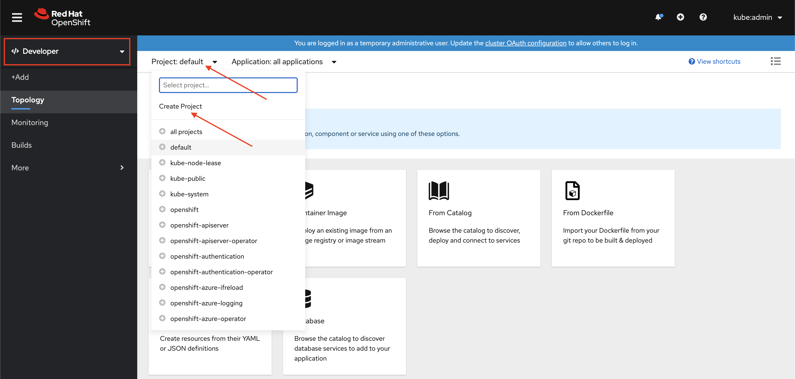
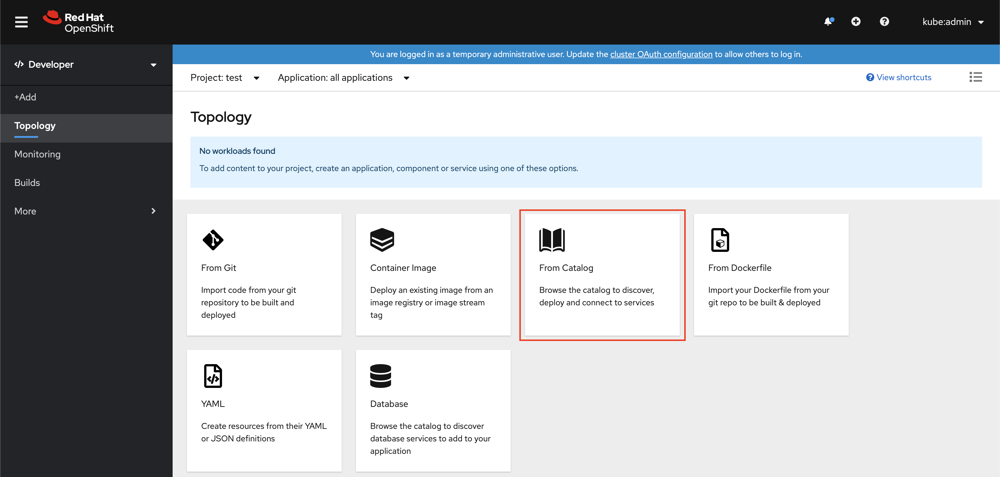
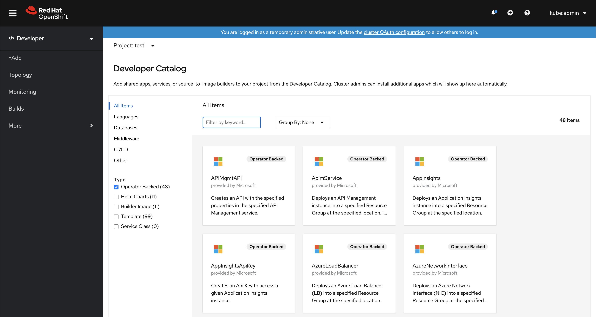

# Step 2: Explore the Azure Service Catalog

[Back to Step 1: Installing the Operator](01-install-operator.md)

Now that Azure Service Operator has been installed and configured, let's take a look at what is available from the catalog.

## Create a Test Project

So that we don't accidentally create resources in a project that we care about, let's first create a new Project (namespace) in OpenShift.

* First, switch to the **Developer** view in the web console.  This toggle is at the top of the left navigation menu.
* Next, at the top of the main window click on the **Project** drop down and select *Create Project*.
* Give your new project a name (e.g. `test`) and click **Create**.
* You will now be in your new project/namespace.

In the middle of the screen you will see a number of ways to **Add** workloads to your Project.  Click on **From Catalog** to view the developer catalog.  

Right away you should notice a number of `Operator Backed` Azure catalog itmes.  Take a moment to browse throug the list to see what is available!

Once you have taken a look around at what is available, we'll move on to the next step and create a container image for a Spring Boot application directly from a GitHub repo!

[Step 3: Build the Pet CLinic Application](03-build-app.md)
