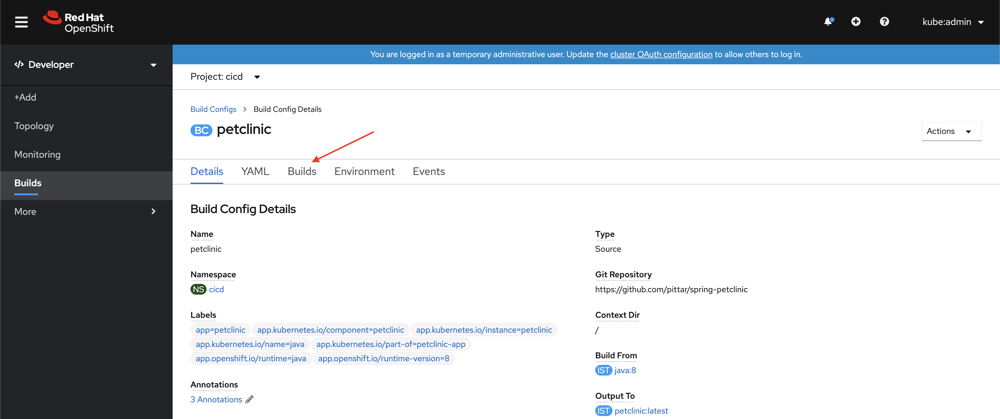
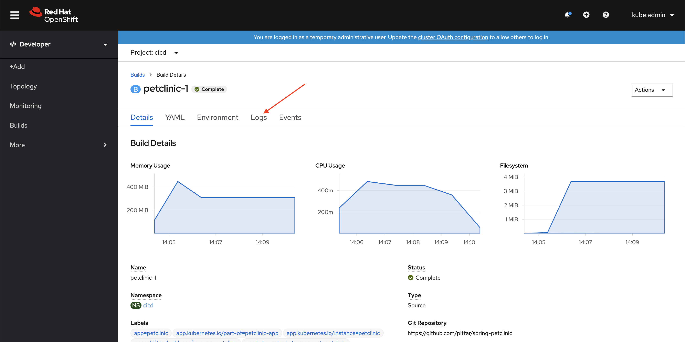
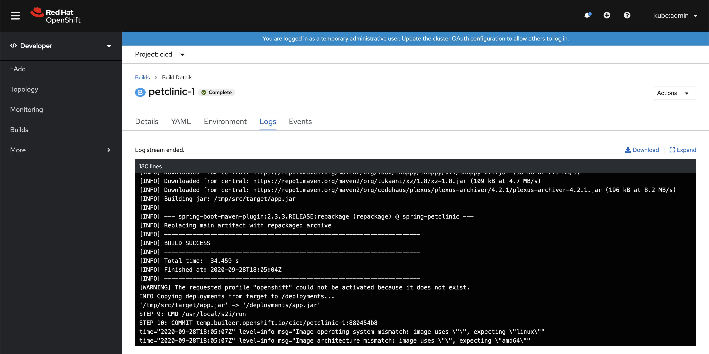

# Step 3: Build the Pet Clinic Demo App

[Back to Step 2: Explore the Azure Service Catalog](02-explore-catalog.md)

Although it is still pretty cool, simply creating a native Azure service from OpenShift does not make for a great demo.  We need an application to consume this Azrue service to really show the value of this integration!

Even better, how about showing how you can use both a *"containerized"* service as well as the *"native/managed"* equivalent!

The application were are going to build can connect to a MySQL 8 database to save data.  In our **DEV** environment we will use a MySQL 8 container.  In our **PROD** environment we will use a native Azure managed MySQL 8 service.

Why both?  See if you can think of why using a MySQL container in *dev/test* environments might have interesting advantages, and why a managed service in *prod* is probably the way to go.  We'll discuss the reasoning a bit later, but for now let's build this app!

## A Quick Note on Kustomize

One thing that I love about the Azure Service Operator is that you treat these services just like any other resource in a Kubernetes/OpenShift environment... as a custom resource (yaml file) that is part of your git repository.  This follows the declarative pattern that is so common in Kubernetes.  You describe what you want to happen, and Kubernetes (or in this case, the Azure Service Operator) will make it so.

To show how nicely this integrates with standard Kubernetes tooling and processes, we will use [Kustomize](https://github.com/kubernetes-sigs/kustomize) to define our *CI/CD*, *DEV*, and *PROD* environments.  Kustomize is a great kubernetes-native tool that allows for templating Kubernetes resources in a natural way.  When you use Kustomize, you don't need to copy/paste YAML files all over the place, you start with common "base" resources and add to them (or patch them) in "overlay" directories.  

Although this demo won't go deep into Kustomize, the examples in this repo an serve as a simple introduction if you want to take a look.  Otherwise, the main point of useing Kustomize is to show how easy it is to create Azure services in a Kuubernetes-native way.

Oh, and one of the best features of Kustomize is that it is baked right into recent versions of both the `kubectl` and `oc` command line tools!  Anywhere that you see a `-k` flag in a command, you'll know that is Kustomize in action!

## Create the "CI/CD" Project and the Build

Enough setup already... let's build something!

First, we will create our *CI/CD* project.  We won't stand up a full toolchain in this demo, just a simple [source-to-image](https://docs.openshift.com/container-platform/4.5/builds/understanding-image-builds.html#build-strategy-s2i_understanding-image-builds) build that will build a new container image straight from the source in a git repository.

Let's start with an `oc` (or `kubectl`) command line call that will use Kustomize (notice the `-k` flag).

```
oc apply -k overlays/cicd
```

The output should look like:

```
namespace/cicd created
rolebinding.rbac.authorization.k8s.io/cicd-image-puller created
buildconfig.build.openshift.io/petclinic created
```

This created a new Project/namespace called `cicd`.  We can switch to this new namespace with the cli:

```
oc project cicd
```

We can then check the status:

```
oc status

In project cicd on server <your openshift server>

bc/petclinic source builds https://github.com/pittar/spring-petclinic on openshift/java:8
  -> istag/petclinic:latest
  build #1 running for 37 seconds - 88d2c83: Update application-azure.properties (Andrew Pitt <apitt@redhat.com>)
```

Based on this, you can see that the build was created and is already running.

In the OpenShift web console:
* Make sure you are in "Developer" view (top of left navigation).
* Use the **Project** drop-down in the main window to select the new `cicd` project.
* From the left navigation, select "Builds"
* Click on the `petclinic` build.

You should end up at a screen that looks like this.  Click "Builds" from the main window.



* **Click** on the build.  There should only be one.
* From here you can click on the *Logs* option to to view the build logs.





Once this build is complete a new image will be available in the "CI/CD" project named `petclinic:latest`.  We will refer to this in the next two steps.

Time to deploy to *DEV*!

[Step 4: Deploy Pet Clinic connected to a MySQL Container](04-deploy-dev.md)
