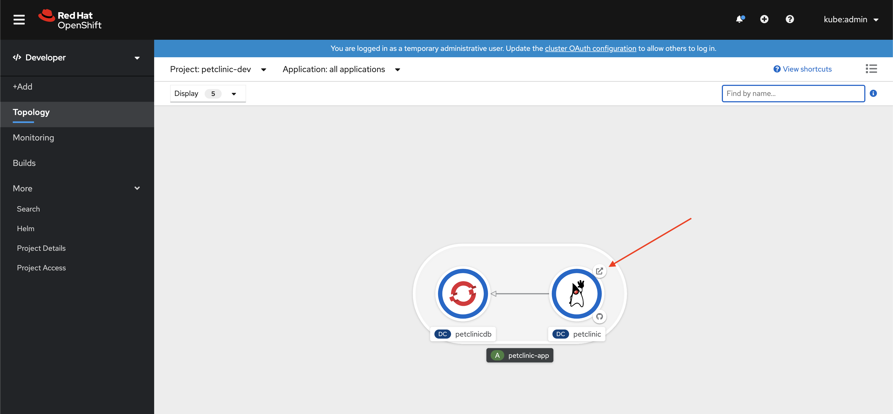

# Step 4: Deploy to DEV with a MySQL Container

[Back to Step 3: Build the Pet CLinic Application](03-build-app.md)

The Pet Clinic application container that we built in the last step needs to connect to MySQL to store data.

Now that we have the **Azure Service Operator** installed in our cluster, we have some options for MySQL!  The obvious options are:
* Create a native Azure managed MySQL service, or
* Use a MySQL container from the OpenShift container catalog

From an application perspective, we should not need to change anything in order to use a MySQL container vs an Azure MySQL instance? So... what should we use for our DEV environment?

Most applications (especially [Quarkus](https://quarkus.io/) or Spring Boot) have connection information configured as properties that can be overridden at run time with environment variables.  This is also how our Pet Clinic application works!  You can see the [Azure configuration properties here](https://github.com/pittar/spring-petclinic/blob/master/src/main/resources/application-azure.properties).

Many development teams chose to use tools such as Hibernate, [Liquibase](https://www.liquibase.org/), or [Flyway](https://flywaydb.org/) to manage and version their database schemas as part of their application.  This is also how Pet Clinic works.  We don't need a DBA to pre-configure tables and data for us, the app will do that when it starts!

This means as long as we use a MySQL 8 server with an empty `petclinic` database, we should be good to go.

So, what option should we use in our DEV environment?

##  DEV: MySQL container or service?

Although there is really no *wrong* answer here, in DEV *using a container* for our MySQL server has a number of advantages:

1. **It's really fast.**  A new MySQL container can be up and running in seconds.  This can be important in CI/CD pipelines, or for running end-to-end test suites.
2. **There's no added cost.** A MySQL container runs in the OpenShift cluster you have already provisioned.  It doesn't require a new VM.  This can help save cost, especially in dev/test environments.
3. **It can be ephemeral.** You decide if the database needs persistence or not.  A database that might only exist for as long as it takes for a test suite to run may not require persistence at all. Again, saving a little more money in a dev/test environment.
4. **It *can* be persistent.** This might seem obvious, but it's worth noting that you can use a "persistent volume claim" so that your data will survive rerstarts of the MySQL container/pod.  This is good for longer-living dev/test environments.

With this in mind, we will use a MySQL 8 container in our DEV environment.

## Create the DEV Environment and Deploy Pet Clinic and MySQL

Once more we have [Kustomize](https://github.com/kubernetes-sigs/kustomize) come to the rescue to make it super easy to consistently deploy our environment in a Kubernetes-native way.

If you're interested, you can look at the file structure here:
* [petclinic app base directory](https://github.com/demo-thursday/azure-service-operator/tree/master/base/petclinic)
* [mysql container base directory](https://github.com/demo-thursday/azure-service-operator/tree/master/base/mysql-container)
* [petclinic-dev overlay directory - the one we will reference with our apply command](https://github.com/demo-thursday/azure-service-operator/tree/master/overlays/azure-dev)

Without furthere delay, let's create our *petclinic-dev* environment!

```
oc apply -k overlays/azure-dev
```

This should produce an output similar to:

```
namespace/petclinic-dev created
secret/petclinicdb created
service/petclinicdb created
service/petclinic created
deploymentconfig.apps.openshift.io/petclinicdb created
deploymentconfig.apps.openshift.io/petclinic created
route.route.openshift.io/petclinic created
persistentvolumeclaim/petclinicdb created
```

This has done a number of things, including:
* Create a new *namespace* called `petclinic-dev`
* Create a *DeploymentConfig*, *Service*, and *Route* for the Pet Clinic app.
* Create a *DeploymentConfig*, *Service*, *Secret*, and *PersistentVolumeClaim* for MySQL

In the OpenShift web console **Developer** view, switch to the new `petclinic-dev` project (it should be near the bottom of the project list).  If you don't see a screen with two pods like the one below, make sure you are in the correct project (drop-down near the top of the screen) and that you have "Topology" selected from the left menu.


Once the `petlinicdb` pod is running (it will be a dark blue circle, like in the image above) we can "Rollout" our petclinc application!

To do this:

* Click on `petclinic` pod.  This is the inside of the white circle (the little Java icon).
* From the "DC" (Deployment Config) panel that slides out, click on the **Actions** drop-down.
* Select **Start Rollout**.


You will now see the Pet Clinic pod go through the stages of creaitng and starting the Pet Clinic application.

While your Pet Clinic container is spinning up, you can take a look at the *ENVIRONMENT* variables that will be injected into the container at run time.

From the same "Deployment Config" card, click on the "petclinic" link to few the Deployment Config information.  Here you will find even more information about your Deployment Config.


Click on the **Environment** option, and you will see a list of environment variables and the source of their values.


Here you will find environment variables to set the *active Spring profile*, the *MySQL* server url, as well ast the *MySQL username and password*.  This is how our Spring Boot app knows how to connect to MySQL container instance.  You will notice some of the values (specifically *username* and *password*) come from a `Secret`.  This is the same `Secret` that is used to seed the MySQL container.  This is a great way to make sure you have consistent configuration!

Back to the **Topology** view (from the left menu), once the *petclinic* pod is up and running (dark blue cicrle, the first run takes about 30 seconds, since it also has to setup the database), you can go to the running application by clicking on the *Open URL* icon that is positioned at the top-right of the `petclinic` pod.



This will open a new browser tab and bring you to the Pet Clinic!

To test out the database connectivity:
* Click on *Find Owners* from the top navigation.
* Click the *Add Owner* button.
* Fill in the new pet owner form, then submit.


To find your new owner:
* Click on *Find Owners* from the top navigation.
* Perform an empty search.

You should see your new owner at the bottom of he list.


Cool!  But how do we know this is actually persisted in the MySQL database?

If you trust that it "just worked", then you can move on to [step 5: Deploy Pet Clinic connected to a MySQL Container](04-deploy-dev.md)

If you want to see what's in MySQL:

* Back in the OpenShift web console, from the *Topology* view of the `petclinic-dev` project
* Click on the centre of the `petclinicdb` pod, then click on the pod link that appears in the details dialog.


Here you will find information about the running MySQL pod, including resource consumption.  Browse around if you like, but what we really want to do is click on the **Terminal** tab to enter a terminal right in the MySQL pod!


This MySQL container includes the MySQL command line tool.  We will use this to connect to the database and perform a *select*.

In this web terminal, run the following commands:

```
# Login to the server as root
mysql -u root
```

Once you are logged in, connect to the `petclinic` database.

```
# Connect to the petclinic database.
mysql> \r petclinic
```


Now that you are connected, list all the records in the *owners* table.

```
# List all owners.
mysql> select * from owners;
```

You should see the owner you created in this list.


Next up, time to create a "Prod" environment, including a managed Azure MySQL database!

[Step 5: Deploy Pet Clinic connected to a MySQL Container](05-deploy-prod.md)