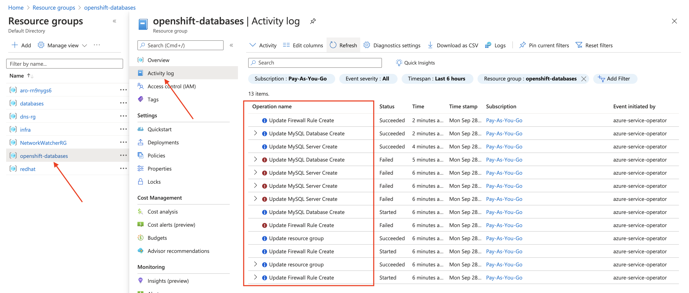

# Step 5: Deploy to PROD with a Managed Azure MySQL Service

[Back to Step 4: Deploy Pet Clinic connected to a MySQL Container](04-deploy-dev.md)

Our Pet Clinic app has been tested in DEV and passed with flying colours.  Now it's time to deploy it to PROD!

In our dev/test environments, we decided to use MySQL container images instead of a managed service because:
* A MySQL container starts much faster than a managed Azure MySQL instance, which requires a new VM.
* A MySQL container doesn't incur any extra VM cost.  It runs on your existing OpenShift cluster.
* Dev/Test environments do not have critical data.  Speed and cost management are prioritized over high availability and ease of upgrades.

*Production*, however, is a different story!

##  PROD: MySQL container or service?

In production, most teams prioritize stability, high availability and ease of upgrades over speed to provision and cost.  For this reason, using a managed Azure MySQL database instance is the obvious choice.  Thanks to the new *Azure Service Operator*, you can have the same Kubernetes / GitOps experience with native Azure services as you can with a container image.  Let's fire up this environment!

## Explaining the PROD Environment and Azure Custom Resources

We will use the same Kustomie process as before to create our PROD environment, but this time a new Azure MySQL instance will be provisioned instead of a MySQL container instance.

If you're interested, you can look at the file structure here:
* [petclinic app base directory - same as in DEV!](https://github.com/demo-thursday/azure-service-operator/tree/master/base/petclinic)
* [mysql azure serivce base directory](https://github.com/demo-thursday/azure-service-operator/tree/master/base/mysql-azure)
* [petclinic-prod overlay directory - the one we will reference with our apply command](https://github.com/demo-thursday/azure-service-operator/tree/master/overlays/azure-prod)

You will notice that the "Pet Clinic" portion is essentially the same.  The differnce between "DEV" and "PROD" is we are injecting different enviornment variables at runtime.  Also, instead of creating a MySQL container instance, we are creating a managed Azure MySQL instance.

This is important, because there is *no copy/paste* of YAML between environments.  Consistency is key!  It also means our Azure MySQL instance is also just a few YAML files!

Although you can browse the git repo to view all these files, I think it's worth taking a look at the Custom Resources that we will use to create this Azure-native database.

First, a new *Resource Group* for our database.  This isn't required, but I wanted to create a new Resource Group to hold this database (and to test out a little more functionality of the operator):

```
apiVersion: azure.microsoft.com/v1alpha1
kind: ResourceGroup
metadata:
  name: openshift-databases
spec:
  location: "canadacentral"
```

This one is pretty self explanatory.  This will create a new *Resource Group* named `openshift-databases` in the `canadacentral` region.

Next, is the actual MySQL Server:

```
apiVersion: azure.microsoft.com/v1alpha2
kind: MySQLServer
metadata:
  name: prod-mysql-aro
spec:  
  location: canadacentral
  resourceGroup: openshift-databases
  serverVersion: "8.0"
  sslEnforcement: Disabled
  createMode: Default # Possible values include: Default, Replica, PointInTimeRestore (not implemented), GeoRestore (not implemented)
  sku:
    name: B_Gen5_1 # tier + family + cores eg. - B_Gen4_1, GP_Gen5_4
    tier: Basic # possible values - 'Basic', 'GeneralPurpose', 'MemoryOptimized'
    family: Gen5 
    size: "51200"
    capacity: 1
```

There's a bit more substance here, but it still is pretty straight forward. I'll go over a few key elements:
* The name of this Server in Azure will be `prod-mysql-aro`.
* The location is `canadacentral` and it will be part of the new `openshift-databases` Resource Group.
* sku:
    * `name`: The name of the VM to be used `B_Gen5_1`.  `B` for "Basic", `Gen5` for vm family, and `1` for # of cores.
    * `tier`: Basic tier.
    * `family`: VM family
    * `size`: Disk size
    * `capacity`: Number of cpu cores.

This makes is pretty clear that this new database will be VM-based.  You can chose your VM size according to your expected workload.

Next up, the database:

```
apiVersion: azure.microsoft.com/v1alpha1
kind: MySQLDatabase
metadata:
  name: petclinic
spec:
  resourceGroup: openshift-databases
  server: prod-mysql-aro
```

So far, this is all making sense.  Here, we are saying that we want a **database** named `petclinic` to be created in the `prod-mysql-aro` **MySQL Server** we created in the `openshift-databases` Resource Group.

Finally, we create a firewall rule to allow other Azure services to connect:

```
apiVersion: azure.microsoft.com/v1alpha1
kind: MySQLFirewallRule
metadata:
  name: openshift-mysql-aro-fw
spec:
  resourceGroup: openshift-databases
  server: prod-mysql-aro
  startIpAddress: 0.0.0.0
  endIpAddress: 0.0.0.0
```

Similar to the *MySQLDatabase* resource, this one creates a **firewall rule** on our `prod-mysql-aro` database that is in the `openshift-databases` Resource Group.

Ok.  That was relatively painless, right?  Not only that, if you're used to Kubernetes resources, you probably find this quite familiar.  You also have the benefit of having your database configuuration verisioned and managed right along side the rest of the infrastructure code for your app!

## Create the PROD Environment and Deploy Pet Clinic and MySQL

Without further ado, we will create our PROD enviornment with a single command:

```
oc apply -k overlays/azure-prod
```

You should then get output similar to:

```
namespace/petclinic-prod created
service/petclinic created
deploymentconfig.apps.openshift.io/petclinic created
mysqldatabase.azure.microsoft.com/petclinic created
mysqlfirewallrule.azure.microsoft.com/pitt-mysql-aro-fw created
mysqlserver.azure.microsoft.com/pitt-mysql-aro created
route.route.openshift.io/petclinic created
```

This has done a number of things, including:
* Create a new *namespace* called `petclinic-prod`
* Create a *DeploymentConfig*, *Service*, and *Route* for the Pet Clinic app
* Create an Azure *ResourceGroup*, *MySQLServer*, *MySQLDatabase*, and a *MySQLFirewallRule*


Take a look at the `mysqls` custom resources (short for `MySQLServer`) to see what his happening:

```
oc get mysqls -n petclinic-prod
```

You should see something like this:

```
NAME             PROVISIONED   MESSAGE
prod-mysql-aro                 request submitted to Azure
```

*The request for a new `MySQLServer` has been submitted to Azure!*

So, what is happening now?

### Azure Portal

For this next part, we will track the progress of the database creation from the Microsoft Azure Portal.

Login to the Microsoft Azure Portal.  You should see the new Resource Group named `openshift-databases`.  If you don't see it yet, wait a moment then refresh your screen.  It can sometimes take a minute or two for the Azure Portal to show new resources.

Take a moment to reflect on the fact that the operator running in OpenShift just created that resource group...

Next, click on the `openshift-databases` Resource Group, then the *Activity Log*.  Eventually, you will end up with an activity log that looks something like this:



You will notice a few things:
1. It will probably take somewhere from 5-7 minutes for your new Azure MySQL database to fully provision.
2. You will see a number of errors in the Activity Log.  This is normal.

As for #1, it's really not a big deal that it takes a few minutes to provision this database.  After all, the entire reason you are using this service is because you need a database that will live a long time, have great availability, and have managed patches/upgrades.

The many failures might seem concerning at first, until you realize what is happening.

Essentially, the Azure Service Operator has received requeusts to create four different things:  A Resource Group, a MySQL Server, a Database on that server, and an associated Firewall Rule.  However, it seems to be trying to make them all at once.

Obviously, order of operations is important in a case like this, but the failures are simply handled by re-tried.  Once the operator creates the Resource Group, it will notice that the `MySQLServer` resource is in a bad state and attempt to fix it.  Once the MySQL Server is up, it will fix the database, and so on.  Eventually, the operator will have all of these components in a healthy state, and the database will be ready to use!

As you can see in the image above, the last three log messages state the Server, Database and Firewall Rule all succeeded.  The successful creation of the Resource Group is down near the bottom of the list.


In the OpenShift web console Developer view, when you switch to the new `petclinic-prod` project, you will see there is only one Pod - Pet Clinic.  This makes sense, since there is *no MySQL container* running in in this project.


If you login into your Microsoft Azure Portal, take a look at the `databases` *Resource Group* and check the *Activity Log*.   It will take 2-3 minutes for any activity to actually appear after you run the `oc apply` command above.  This is normal.

It is also normal to see a few failures before everything succeeds.  With the command above, the MySQL Server, Database, and Firewall Rule are all created at the same time.  Obviously, a database and a firewall rule can't be created until the server is ready!  This is fine, though.  Both the database and firewall rule creation will retry once the server is ready.  Your activty log will look something like this when everything is ready.

You will also know when your database is ready by looking at the Resource Group Overview.  You should see your new database instance listed.

Overall, it will probably take at least 5 minutes for your database to be provisioned and come online.

## Star Pet Clinic in PROD

Ok, we we have a production Azure MySQL database!  Time to start-up the app!

From the `petclinic-prod` project in the OpenShift developer web console:
* Click on the `petclinic` pod (the big circle) and scale up the app by selecting **Start Rollout** From the **Actions** drop down.


Notice there is reference to a `Secret` named `pitt-mysql-aro`?  This was created by the Azure Service Operator!  As part of the provisioning process, the operator creates a `Secret` in your namespace with the connection details that your application will need.  This includes server URL, username, and password.  Neat, eh?
Notice there is reference to a `Secret` named `pitt-mysql-aro`?  This was created by the Azure Service Operator!  As part of the provisioning process, the operator creates a `Secret` in your namespace with the connection details that your application will need.  This includes server URL, username, and password.  Neat, eh?

[Step 6: Cleanup and Conclusion](06-cleanup-and-conclusion.md)
